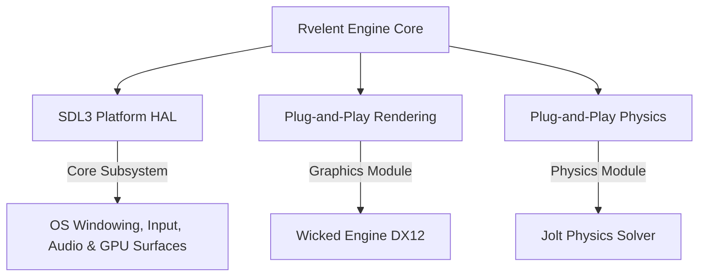

# Rvelent 🚀

> [!WARNING]
> **Project Status: Initial Pre-Alpha Work-in-Progress (WIP)**  
> Rvelent is currently in its infancy. This repository contains the initial core architecture, subsystem abstraction layer, and editor layout. It is an active work-in-progress, and contributions are highly welcome as we lay down the foundation.

Rvelent is an open-source, modular C++20 3D game engine platform designed with a highly flexible, backend-agnostic architecture. 

Inspired by the structural paradigms and unified workspace design of Unreal Engine, Rvelent is architected for clean separation of concerns. While heavy-lifting components like 3D rendering and physics solvers are decoupled into plug-and-play modules, the engine sits on a rock-solid, cross-platform platform abstraction layer powered by **SDL3**.

---

## 🏛️ Core Design Pillars

* **Decoupled Plug-and-Play Modules**: Systems like 3D Rendering and Physics are completely isolated. Developers can swap out backends, such as migrating from a DirectX 12 renderer to a custom Vulkan pipeline, or swapping physics solvers, without changing a single line of gameplay code.
* **SDL3 Platform Backbone**: Rather than just windowing, SDL3 serves as Rvelent's Hardware Abstraction Layer (HAL). It handles OS event loops, low-latency audio pipelines, high-performance input mapping, display/monitor queries, and cross-platform GPU surface integration.
* **Workspace & Editor Environment**: Features a dedicated, docking-based developer editor workspace built using Dear ImGui, providing a unified level design, scene graph hierarchy, property inspector, and console suite.



---

## 📦 Subsystems & Modules

### 1. The SDL3 Platform Foundation (HAL)
The backbone of Rvelent's platform portability and hardware communication. SDL3 manages:
* **OS Interoperability**: Seamless cross-platform window management, screen resolution modes, and hardware handles.
* **Input Routing**: High-performance, low-latency APIs for keyboard, mouse, controllers, and custom peripherals.
* **Audio Pipeline**: Clean, multi-channel audio context generation.
* **Graphics Context Setup**: Handling the raw surface creation and integration between the operating system and modern graphics APIs (DirectX 12 / Vulkan).

### 2. Plug-and-Play Rendering (Wicked Engine)
Abstracted rendering pipelines that handle 3D visualization and viewport drawing.
* **Graphics Module**: Currently backed by a DirectX 12 implementation using **Wicked Engine**.
* **Capabilities**: Advanced PBR, real-time global illumination, dynamic post-processing, volumetric atmospheric rendering, and full live scene viewport integration.

### 3. Modular Physics Solver (Jolt Physics)
Built as a swappable first-class subsystem alongside rendering.
* **Physics Module**: Integrated with **Jolt Physics** for fast, highly parallel rigid-body dynamics, contact listeners, and spatial collision queries.

### 4. Developer Workspace (Dear ImGui)
A clean, docking-based editor workspace designed to unify game testing, scene hierarchy organization, component property editing, and runtime system logs.

---

## 🛠️ Build & Setup

Rvelent uses CMake's `FetchContent` pipeline to automatically fetch, configure, and compile all necessary third-party dependencies (`SDL3`, `Dear ImGui`, `Wicked Engine`) directly from source.

### Prerequisites
* **Compiler**: Modern compiler supporting **C++20** (MSVC 2022 / GCC 11 / Clang 13 or newer).
* **Build System**: **CMake 3.20** or higher.
* **Graphics Pipeline**: Windows SDK installed (required for the DirectX Shader Compiler `dxc.exe` to compile HLSL shaders).

### Getting Started

1. **Clone the Repository**
   ```bash
   git clone https://github.com/Yuvi-GD/Rvelent.git
   cd Rvelent
   ```

2. **Configure the Project**
   ```bash
   cmake -B build
   ```

3. **Build the Engine**
   ```bash
   cmake --build build --config Debug -j 8
   ```

4. **Launch**
   ```bash
   ./Bin/Debug/RvelentEditor.exe
   ```

---

## 🤝 Contributing

We are looking for engine developers, rendering programmers, and physics engineers to help shape Rvelent in its early stages! 

1. Fork the repository.
2. Create your branch (`git checkout -b feature/AmazingFeature`).
3. Commit your changes (`git commit -m 'Add some AmazingFeature'`).
4. Push to the branch (`git push origin feature/AmazingFeature`).
5. Open a Pull Request.

---

## 📄 License

This project is open-source and licensed under the permissive **MIT License**, giving you full personal and commercial freedom to use, modify, and distribute the engine. See the [LICENSE](LICENSE) file for details.
